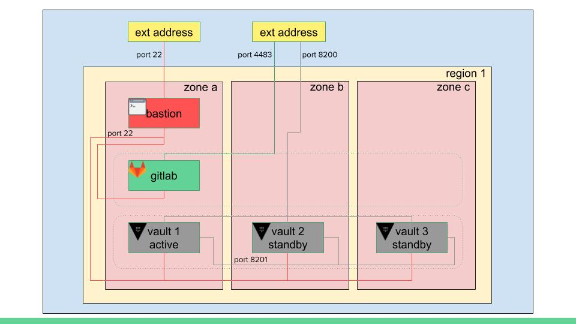
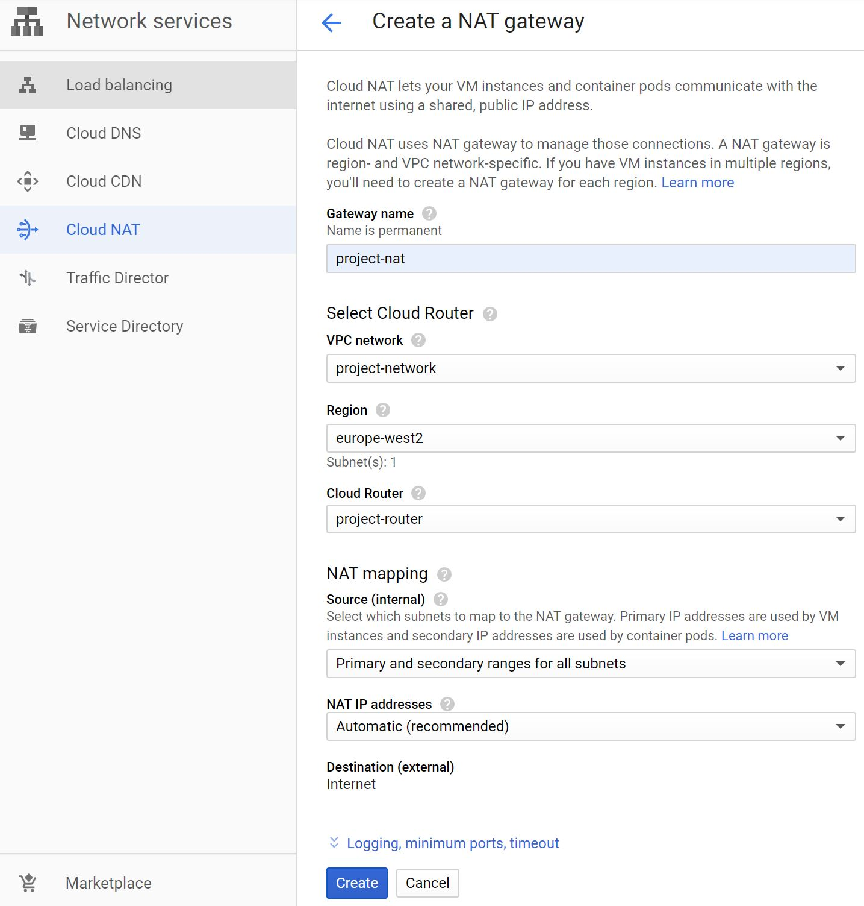

# cloud-gitlab

[](https://opensource.org/licenses/MIT)

Deploy GitLab CE & Hashicorp Vault into cloud instances. Uses Jeff Geerling's [gitlab role](<https://galaxy.ansible.com/geerlingguy/gitlab/>) to install gitlab on the target gitlab instance.

The Vault cluster is deployed using updated roles taken from [this repo](https://github.com/AdamGoldsmith/consul-vault). The cluster deployment takes advantage of Vault's integrated storage option released in version 1.4 which makes life a lot less complicated by removing the need to deploy an entire backend Consul configuration.

#### Network Topology

Here is a generalised diagramatic representation of the deployment. Management of internal instances without external-facing addresses, such as gitlab & vault instances, is performed via a bastion instance using [SSH proxy arguments](#SSH-proxy-&-inventories). A single external address with port-forwarding rules defined is used to reach the desired backend GitLab & Vault services.


#### Supported platforms

| Cloud Provider | Platform |
|----------------|----------|
| Google Cloud Platform | CentOS 8 (default) |
|                       | Ubuntu 16.04 |

#### Requirements

* Pre-configured cloud provider credentials. For example, with GCP a service account JSON file
* SSH key pair for connecting to newly-created instance
* Ansible 2.7+ (tested with 2.9.4)
* Terraform 0.12+ (tested with 0.12.26)

For further information refer to the [Google Cloud Platform Guide](https://docs.ansible.com/ansible/latest/scenario_guides/guide_gce.html)

#### Python3 virtual environment (recommended)

The steps below illustrate an example setup with a `python3` virtual environment.  There are many ways to achieve this goal but this is a simple method and assumes that you have `python3` installed on your linux environment.

__For GCP__

```
mkdir -p ~/venvs
python3 -m venv ~/venvs/cloud-gitlab_gcp
source ~/venvs/cloud-gitlab_gcp/bin/activate
git clone https://github.com/AdamGoldsmith/cloud-gitlab.git
cd cloud-gitlab
pip install -r ./requirements_gcp.txt
```

#### GCP credentials

You will need valid credentials for GCP to be able to deploy the project.  This is covered in the [Credentials](https://docs.ansible.com/ansible/latest/scenario_guides/guide_gce.html#credentials) section of the Ansible GCP guide.  Assuming that you have created a `Service Account` and have the `.json` file downloaded you can perform the following example steps, pasting in and saving your `Service Account`.`json` contents at the `vi` step:

```
mkdir -p ~/gcp
vi ~/gcp/gitlab-creds.json
chmod 0600 ~/gcp/gitlab-creds.json
```

#### SSH keypair

As mentioned, a keypair is required to connect to the GCP instances. By default the deployment will look in `~/gcp` for the required key.  To create the location and keypair you can work through the following example:

```
cd ~/gcp
ssh-keygen
Generating public/private rsa key pair.
Enter file in which to save the key (/home/tony/.ssh/id_rsa): ./id_rsa
Enter passphrase (empty for no passphrase):
Enter same passphrase again:
Your identification has been saved in ./id_rsa.
Your public key has been saved in ./id_rsa.pub.
The key fingerprint is:
SHA256:1YP0ULXqssHeCO8Yc2sCsOUWAvj6aSfIcVynRRN06nM tony@CPX-ZL3E87HNB8M
The key's randomart image is:
+---[RSA 2048]----+
| .    .o..o....  |
|. .    oo. =   . |
| . .  ... o + .  |
|  . o.+o .   o   |
| .. .*++SE  .    |
|.. o..+ o. .     |
|.oo. . .+ = .    |
|..= .   .O.B     |
| . o    .+B .    |
+----[SHA256]-----+
```

#### Getting the code

```
git clone https://github.com/AdamGoldsmith/cloud-gitlab.git
```

#### SSH proxy & inventories

It is worth noting, I have chosen to connect to cloud-hosts via an SSH proxy (bastion) host to keep management and costs to a minimum.

This Ansible configuration uses a mixture of static & dynamic inventories residing in an inventory directory called `inv.d` (configured in [`ansible.cfg`](ansible.cfg)).

There is a group called `sshproxy` which has an associated [`group_vars/sshproxy/vars.yml`](inv.d/group_vars/sshproxy/vars.yml) file. In this file, if a remote Ansible host is detected on a public IP address, Ansible will attempt to connect directly to the target. However, if the host is detected on a private IP address, Ansible will set SSH Proxy arguments to connect to the target via the first SSH proxy host found in the `bastion` group (this deployment only stands up one bastion instance).

Only hosts/groups in the `sshproxy` group will be affected by this process.

__Note__: To force GCP's dynamic inventory [configuration file](inv.d/inventory.gcp.yml) to return the internal IP addressses of instances, uncomment the following lines:
```yaml
# hostnames:
#   - private_ip
```
More information on GCP's dynamic inventory can be found [here](https://www.diewufeiyang.com/ansible/en/plugins/inventory/gcp_compute.html)

### Cloud Providers Section

#### GCP

##### Ansible & Terraform

The entire project's infrastructure resources are deployed with Terraform via Ansible calling the `terraform` module. This way an end-to-end project deployment can be completed by running a single Ansible command. Individual components/services can be targeted by using the appropriate tags which is explained later.

##### Inventory

As stated, this configuration uses a mixture of static and dynamic inventory sources. Instances are created with a label key called `ansible_group` which takes the service name as a value. Inspecting the contents of the GCP dynamic inventory [configuration file](cloud-gitlab\inv.d\inventory.gcp.yml) shows the following section:
```yaml
keyed_groups:
  - prefix: gcp
    key: labels
```

This is used to reference the label added at instance creation. For example, adding a label of `vault` to instances will allow Ansible to reference them by a group named `gcp_ansible_group_vault` as can be seen in the [inventory file](inv.d/inventory):
```ini
[gcp_ansible_group_vault]
```

To make things easier to reference, the shorter-named `vault` group was defined in the [inventory file](inv.d/inventory) with `gcp_ansible_group_vault` as its children:
```ini
[vault:children]
gcp_ansible_group_vault
```

As was the `gcp` group name:
```ini
[gcp:children]
gcp_ansible_group_bastion
gcp_ansible_group_gitlab
gcp_ansible_group_vault
```

#### project_data dictionary structure

The infrastructure resources configuration are stored in a dictionary structure called `project_data` defined in the `localhost` [inventory vars file](inv.d/host_vars/localhost/gcp.yml)

Let's inspect it and break it down in sections:

```yaml
project_data:
  # Base network configuration for the project
  network:
    name: project
    region: "{{ project_region }}"
```
The first resource created in the GCP environment is the network. Here we name it and give it a region (defined earlier in this file). The name is appended with `-network` suffix so in the example above the resulting name will be `project-network`.

```yaml
  services:
    # No instances but a generic ext address & fw rules
    base:
      ext_addresses:
        - name: 1
      scopes:
        - https://www.googleapis.com/auth/compute
      fw_data:
        - name: allow-internal
          description: Allow all UDP/TCP ports internally
          allowed:
            - ip_protocol: tcp
              ports:
                - '0-65535'
            - ip_protocol: udp
              ports:
                - '0-65535'
            - ip_protocol: icmp
          source_ranges:
            - '10.128.0.0/9'
          pri: 65534
        - name: allow-icmp
          description: Allow ICMP externally
          allowed:
            - ip_protocol: icmp
          pri: 65534
        - name: allow-ssh
          description: Allow SSH externally
          allowed:
            - ip_protocol: tcp
              ports:
                - '22'
          pri: 65534
```
Here we see the `services` section of the data structure where resources are defined for each particular service. In the example above, the service is `base` which has been used here to define some common network resources that need to persist independently of other services.

`ext_addresses` is a list of standalone external addresses to define. In this particular case, the external address being defined here will be used by other services that are defined later (we will take a look at this further down). The final name of the external address resource becomes `<service>-<user-supplied-name>-address`, so in the example above the resulting name will be `base-1-address`.

`scopes` is a list of GCP scopes to be used for defining this service

`fw_data` is a list of dictionaries of the following structure:

|key|value|
|---|-----|
|`name`|name of the firewall rule|
|`description`|description of the firewall rule|
|`allowed`|list of dictionaries containing the firewall rules data|
|`ip_protocol`|protocol type (tcp, udp, icmp, esp, ah, sctp)|
|`ports`|optional list of ports for udp/tcp (examples include `["22"]`, `["80","443"]`, and `["12345-12349"]`)|
|`source_ranges`|optional list that the firewall will apply only to traffic that has source IP address in these ranges|
|`pri`|priority of rule, lowest is preferenced (0-65534)|
See Ansible's [gcp_compute_firewall module documentation](https://docs.ansible.com/ansible/latest/modules/gcp_compute_firewall_module.html) for more details

```yaml
    bastion:
      instances:
        - name: 1
          disk:
            size_gb: 20
            source_image: projects/centos-cloud/global/images/family/centos-8
            # source_image: projects/ubuntu-os-cloud/global/images/family/ubuntu-1604-lts
          machine_type: f1-micro
          zone: "{{ project_region }}-a"
          create_external_ip: yes
      scopes:
        - https://www.googleapis.com/auth/compute
```
We are now looking at the `bastion` service section which has some new parts to the data structure.

`instances` is a list of dictionaries describing compute VMs:
|key|value|
|---|-----|
|`name`|name of the instance converted into `<service>-<user-supplied-name>-vm` (eg `bastion-1-vm`)|
|`disk`|dictionary of data pertaining to the instance disk|
|`size_gb`|size of disk to create (minimum 20)|
|`source_image`|image to use for boot disk|
|`machine_type`|VM's machine type|
|`zone`|zone to create the instance in|
|`create_external_ip`|boolean to create and attach a dedicated external address|
See Ansible's [gcp_compute_instance module documentation](https://docs.ansible.com/ansible/latest/modules/gcp_compute_instance_module.html) for more details

```yaml
    gitlab:
      instances:
        - name: 1
          disk:
            size_gb: 20
            source_image: projects/centos-cloud/global/images/family/centos-8
            # source_image: projects/ubuntu-os-cloud/global/images/family/ubuntu-1604-lts
          machine_type: n1-standard-1
          zone: "{{ project_region }}-a"
          create_external_ip: no
      target_pool_data:
        - name: 1
          ip_protocol: TCP
          port_range: 4483-4483
          # Use the external address created for 'base' named '1'
          address:
            service: base
            name: 1
      scopes:
        - https://www.googleapis.com/auth/compute
      fw_data:
        - name: allow-gitlab
          description: GitLab service port
          allowed:
            - ip_protocol: tcp
              ports:
                - '4483'
          pri: 65500
```
We are now looking at the `gitlab` service section which has some new parts to the data structure. Notice that `create_external_ip` is set to `no` as this instance does not need to directly face the internet.

`target_pool_data` is a list of dictionaries describing how to reach the backend service:
|key|value|
|---|-----|
|`name`|name of the target pool converted into `<service>-<user-supplied-name>-target-pool` (eg `gitlab-1-target-pool`)|
|`ip_protocol`|IP protocol to which this rule applies (TCP, UDP, ESP, AH, SCTP or ICMP)|
|`port_range`|only packets addressed to ports in the specified range will be forwarded to target|
|`address`|dictionary of data related to the associated source external address|
|`service`|name of service used to create the external address (eg `base`)|
|`name`|name of the service's address resource (eg `base-1-address`)|
See Ansible's [gcp_compute_target_pool module documentation](https://docs.ansible.com/ansible/latest/modules/gcp_compute_target_pool_module.html) for more details
See Ansible's [gcp_compute_forwarding_rule module documentation](https://docs.ansible.com/ansible/latest/modules/gcp_compute_forwarding_rule_module.html) for more details

There are further firewall rules defined here specific to the gitlab service to append to the common rules defined in the `base` service section.

#### Overview of events

Generally, the following steps will be performed when no tags are specified:

1. Create base network configuration:
    * A network
    * An external address (through which backend services will be reached)
    * Common firewall rules (All UDP/TDP ports on internal network, external SSH, etc)
    * A cloud router (to be used with Cloud NAT - see [limitations & known issues](#limitations-&-known-issues))
2. Create a bastion service (for managing internal, non internet-facing instances):
    * firewall rules
    * external interface for instance to use
    * disk & instance
3. Create a gitlab service:
    * firewall rules
    * No external interface
    * disk & instance
    * target pool & forwarding rules associated with base external address created in step 1 for external connectivity
4. Install GitLab software
5. Create a vault service:
    * firewall rules
    * No external interface
    * disk & instance (x3)
    * target pool & forwarding rules associated with base external address created in step 1 for external connectivity
6. Install & configure Vault cluster
    * Install vault
    * Configure vault
    * Enable approle
    * Enable sshkeysign

#### Running the deployment

1. To create GCP instances & install GitLab + Vault Cluster
```
ansible-playbook playbooks/site.yml --extra-vars cloud_provider=gcp
```
__Note:__ Technically the `--extra-vars` is not needed as the default cloud is GCP.

2. To install GitLab & Vault to existing instances
```
ansible-playbook playbooks/site.yml --extra-vars cloud_provider=gcp --tags install
```

3. To destroy GCP GitLab & Vault deployment
```
ansible-playbook playbooks/site.yml --extra-vars cloud_provider=gcp --tags destroy
```

#### Deployment outcome

After the deployment has finished, assuming the base external ip address is 123.123.123.123, you should be able to reach the services as follows:

|Service|Address|
|-------|-------|
|GitLab|https://123.123.123.123:4483|
|Vault|https://123.123.123.123:8200|

#### Limitations & known issues

1. Both GitLab & Vault services use HTTPS connections, however this deployment implements self-signed certificates. Although there is nothing strictly wrong with this for a development environment, you will receive certificate warnings when you connect to the services. It is recommended that you install certificates signed by a trusted CA if you choose to deploy into a production environment.

2. When vault is initialized, the master key shards & root token are stored in the ansible user's HOME dir on the Ansible control machine. This is __NOT__ good practice, but was used to get things running. It is recommended to read through Vault's [Seal/Unseal documentation page](https://www.vaultproject.io/docs/concepts/seal), in particular the section on [auto-unsealing](https://www.vaultproject.io/docs/concepts/seal#seal-unseal). Alternatively, this method of using [PGP, GPG, and Keybase](<https://www.vaultproject.io/docs/concepts/pgp-gpg-keybase.html>) unsealing might appeal.

##### GCP

1. Creating a VM without an external IP address, then re-running the create after changing the instance option to create an external IP address will create an external IP address but it will not attach it to the instance. You will need to attach this manually.

2. If you change an instance option to omit creating an external IP address after you have created it, the destruction of that instance will not remove the external IP address from the project resources.

3. Any shared firewall rule definitions can be deleted when destroying instances. It is recommended to put shared firewall definitions in the `base` service stanza in the `project_data` dictionary defined in the [gcp variables file](cloud-gitlab\inv.d\host_vars\localhost\gcp.yml).

4. The easiest way to allow internal instances to reach the internet for tasks such as installing/upgrading software is to enable Cloud NAT. Currently, there is no Ansible module to create a Cloud Gateway NAT resource. A Cloud Router resource called `project-router` is automatically created during the [`base_create.yml`](playbooks/base/base_create.yml) playbook, however a Cloud Gateway needs to be manually created to use it. It is recommended that as soon as the `create_base.yml` playbook has completed, you create the Cloud Gateway or else the internal instances will fail to install any software. Here's an example using the GCP Console:

*I am considering off-loading this step to Terraform or using the `uri` module with the correct API call but until then this is a known issue*

5. The load balancer doesn't have an associated health check defined for the Vault service as it uses HTTPS to query its status. There are ways to configure HTTPS health checks but I haven't pursued this yet. As it stands, when connecting to the vault service, the configured load balancer will hit any of the backend vault instances which is usually OK as Vault redirects traffic to the active instance. Problems may arise if the state of the Vault instance being targetted is unhealthy/sealed/uninitialised/etc, so be aware of this.
